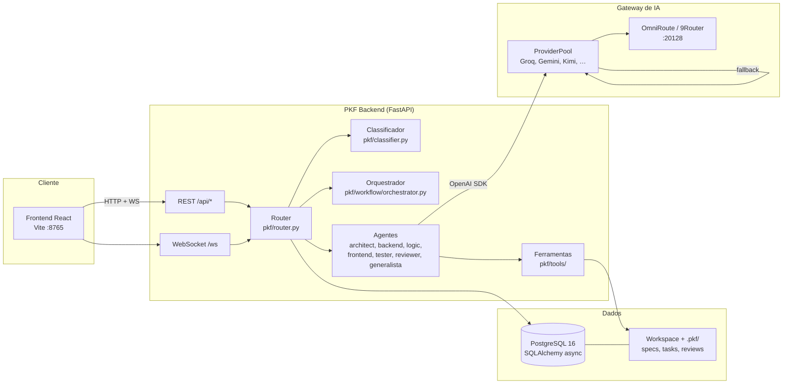
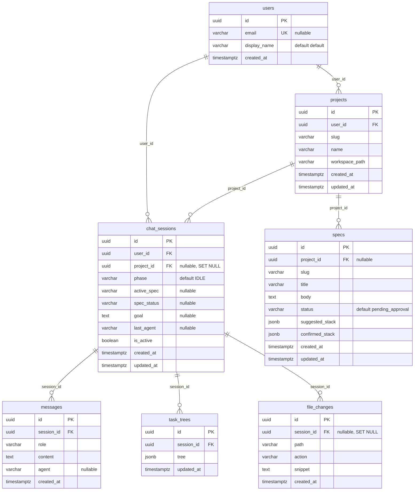
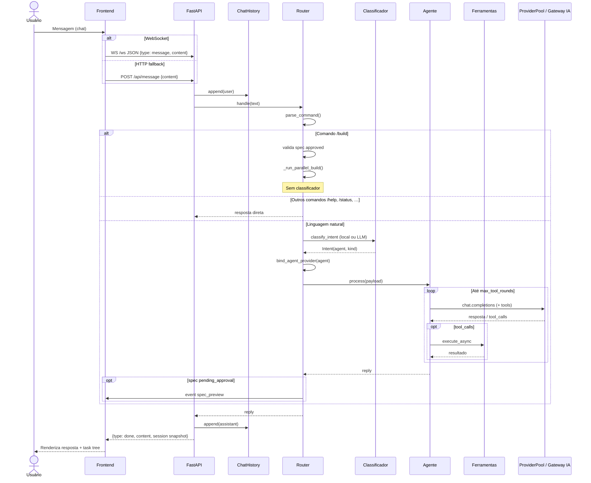
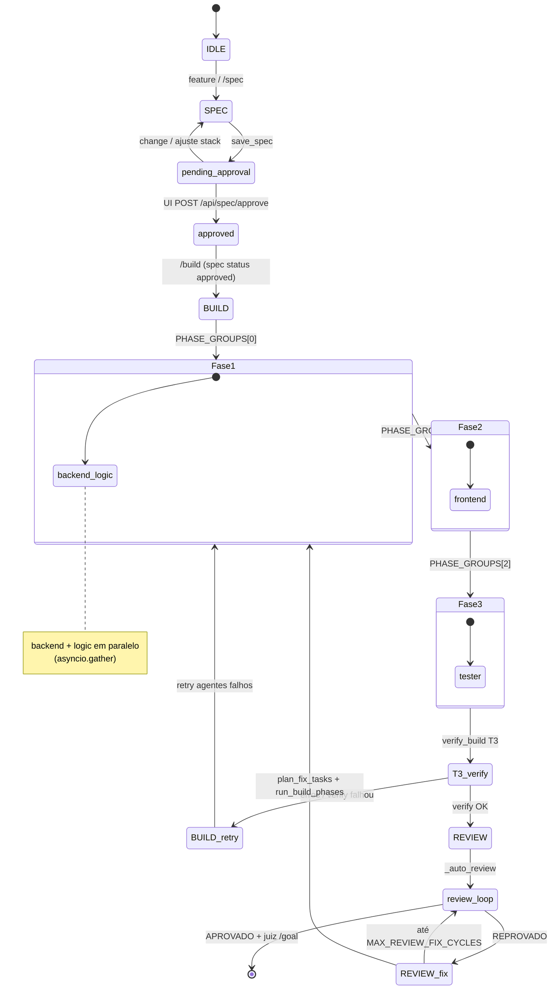

# Arquitetura técnica — PKF

Documentação complementar a [`PKF.md`](../PKF.md). Descreve componentes, banco, fluxos e API com base no código em `pkf/`.

---

## 1. Visão geral

A PKF (Plataforma de Desenvolvimento com IA) é um assistente multiagente para equipes e desenvolvedores que querem **especificar, implementar, revisar e testar** software em um ciclo guiado. A metodologia central é `/spec → /build → /review`: o arquiteto gera e refina a especificação; após aprovação manual na UI, o pipeline `/build` planeja tarefas por agente (backend, lógica, frontend, tester), executa fases paralelas ou sequenciais conforme dependências, verifica artefatos gerados e entra em loop automático de review→correção até aprovação ou limite de ciclos.

A plataforma combina backend Python (FastAPI + WebSocket), frontend React (Vite), PostgreSQL opcional para persistência de chats/specs/tarefas, e um **gateway de IA** (OmniRoute/9Router na VPS, com fallback para Groq, Gemini e outros via `ProviderPool`). O roteador (`pkf/router.py`) centraliza comandos, classificação de intenção, delegação a agentes especializados e orquestração do build (`pkf/workflow/orchestrator.py`).

Para stack de deploy, variáveis de ambiente e comandos operacionais, consulte [`PKF.md`](../PKF.md).

---

## 2. Diagrama de arquitetura



---

## 3. Esquema do banco de dados (UML)

Extraído de `pkf/db/models.py` (7 tabelas).



### users

| Coluna | Tipo | Descrição |
|--------|------|-----------|
| `id` | UUID (PK) | Identificador do usuário |
| `email` | String(320), unique, nullable | E-mail opcional |
| `display_name` | String(120), default `"default"` | Nome exibido |
| `created_at` | DateTime(tz), server default | Criação |

### projects

| Coluna | Tipo | Descrição |
|--------|------|-----------|
| `id` | UUID (PK) | Identificador do projeto |
| `user_id` | UUID (FK → users.id, CASCADE) | Dono |
| `slug` | String(120), index | Slug do workspace |
| `name` | String(200) | Nome legível |
| `workspace_path` | String(500) | Caminho no filesystem |
| `created_at` | DateTime(tz) | Criação |
| `updated_at` | DateTime(tz) | Última atualização |

### chat_sessions

| Coluna | Tipo | Descrição |
|--------|------|-----------|
| `id` | UUID (PK) | Sessão de chat |
| `user_id` | UUID (FK → users.id, CASCADE) | Usuário |
| `project_id` | UUID (FK → projects.id, SET NULL), nullable | Projeto vinculado |
| `phase` | String(32), default `"IDLE"` | Fase do ciclo dev |
| `active_spec` | String(120), nullable | Nome da spec ativa |
| `spec_status` | String(32), nullable | Status da spec |
| `goal` | Text, nullable | Meta `/goal` |
| `last_agent` | String(64), nullable | Último agente usado |
| `is_active` | Boolean | Sessão ativa |
| `created_at` | DateTime(tz) | Criação |
| `updated_at` | DateTime(tz) | Última atualização |

### messages

| Coluna | Tipo | Descrição |
|--------|------|-----------|
| `id` | UUID (PK) | Mensagem |
| `session_id` | UUID (FK → chat_sessions.id, CASCADE) | Sessão |
| `role` | String(32) | `user` ou `assistant` |
| `content` | Text | Conteúdo |
| `agent` | String(64), nullable | Agente que respondeu |
| `created_at` | DateTime(tz) | Timestamp |

### specs

| Coluna | Tipo | Descrição |
|--------|------|-----------|
| `id` | UUID (PK) | Registro |
| `project_id` | UUID (FK → projects.id, CASCADE), nullable | Projeto |
| `slug` | String(120), index | Nome/slug da spec |
| `title` | String(200) | Título |
| `body` | Text | Corpo Markdown |
| `status` | String(32), default `"pending_approval"` | Ex.: `pending_approval`, `approved` |
| `suggested_stack` | JSON/JSONB | Stack sugerida pelo arquiteto |
| `confirmed_stack` | JSON/JSONB | Stack confirmada na aprovação |
| `created_at` | DateTime(tz) | Criação |
| `updated_at` | DateTime(tz) | Última atualização |

### task_trees

| Coluna | Tipo | Descrição |
|--------|------|-----------|
| `id` | UUID (PK) | Registro |
| `session_id` | UUID (FK → chat_sessions.id, CASCADE) | Sessão |
| `tree` | JSON/JSONB (list) | Árvore de tarefas do build |
| `updated_at` | DateTime(tz) | Última atualização |

### file_changes

| Coluna | Tipo | Descrição |
|--------|------|-----------|
| `id` | UUID (PK) | Registro |
| `session_id` | UUID (FK → chat_sessions.id, SET NULL), nullable | Sessão |
| `path` | String(500) | Caminho relativo |
| `action` | String(32) | Ex.: create, overwrite |
| `snippet` | Text | Trecho ou diff resumido |
| `created_at` | DateTime(tz) | Timestamp |

---

## 4. Fluxo de uma requisição (input → resposta)

Baseado em `pkf/router.py`, `pkf/web/server.py` e `pkf/agents/base.py`.



**Gateway de IA:** `ProviderPool.get_client()` retorna `AsyncOpenAI` apontando para OmniRoute (`NINEROUTER_URL`) ou provedores diretos (Groq, Gemini, etc.). Em erro 429/401/5xx, `Router.try_rotate_provider()` troca de slot/tier.

**Streaming:** eventos intermediários (`progress`, `task_tree`, `routing`, `spec_preview`) via WebSocket quando `router.set_event_handler` está ativo; em `ui_mode` alguns eventos são suprimidos ou condensados em `progress`.

---

## 5. Ciclo `/spec → /build → /review`

Estados da spec e fases do build conforme `pkf/workflow/cycle.py`, `pkf/workflow/planner.py` (`PHASE_GROUPS`) e `pkf/router.py`.



**PHASE_GROUPS** (`pkf/workflow/planner.py`):

```python
PHASE_GROUPS = (
    ("backend", "logic"),  # Fase 0 — paralelo
    ("frontend",),         # Fase 1 — sequencial
    ("tester",),           # Fase 2 — sequencial
)
```

O planner heurístico (`plan_build`) ou LLM (`plan_build_llm`) inclui apenas agentes necessários à spec. `group_tasks_into_phases` agrupa por `task.phase`. O orquestrador (`run_build_phases`) executa cada fase em sequência; tarefas dentro da mesma fase rodam em paralelo via `asyncio.gather`.

---

## 6. Endpoints da API

Extraídos de `pkf/web/server.py`. Autenticação via `AuthMiddleware` (`pkf/web/auth.py`): `Authorization: Bearer <PKF_AUTH_TOKEN>`, header `X-PKF-Token` ou query `?token=`. WebSocket usa subprotocol `pkf-token.<token>` ou query `?token=`.

| Método | Caminho | Autenticação | Propósito |
|--------|---------|--------------|-----------|
| GET | `/` | Pública | SPA (index.html) |
| GET | `/favicon.ico` | Pública | Ícone (204) |
| GET | `/assets/*` | Pública | Assets estáticos Vite |
| GET | `/api/health` | Pública | Health mínimo (`ok`, `auth_required`) |
| GET | `/api/preview-token` | Bearer (rate limit 30/min) | Emite token de preview temporário |
| GET | `/api/preview` | Bearer | Info do preview + token |
| GET | `/preview` | `preview_token` ou Bearer | Redirect para entry do projeto |
| GET | `/preview/{rel_path}` | `preview_token` ou Bearer | Serve arquivo do workspace |
| GET | `/api/library` | Bearer | Lista chats e projetos |
| POST | `/api/chats` | Bearer | Cria novo chat |
| POST | `/api/chats/{chat_id}/activate` | Bearer | Ativa chat e carrega histórico |
| DELETE | `/api/chats/{chat_id}` | Bearer | Exclui chat |
| PATCH | `/api/chats/{chat_id}` | Bearer | Renomeia chat (`title`) |
| POST | `/api/chats/{chat_id}/attach` | Bearer | Anexa chat a projeto (`project_slug`) |
| POST | `/api/projects/{slug}/activate` | Bearer | Ativa projeto no workspace |
| PATCH | `/api/projects/{slug}` | Bearer | Renomeia projeto (`name`) |
| DELETE | `/api/projects/{slug}` | Bearer | Exclui projeto |
| POST | `/api/projects/bulk-delete` | Bearer | Exclusão em lote (`slugs` ou `all`) |
| POST | `/api/projects/{slug}/pin` | Bearer | Fixa/desfixa projeto (`pinned`) |
| GET | `/api/session` | Bearer | Snapshot completo (provider, spec, tasks, preview) |
| POST | `/api/reset` | Bearer | Reseta conversa e workspace do chat |
| POST | `/api/spec/approve` | Bearer | Aprova spec (`name`, `confirmed_stack`) |
| POST | `/api/spec/stack` | Bearer | Atualiza stack confirmada antes da aprovação |
| GET | `/api/files` | Bearer | Árvore de arquivos do workspace |
| GET | `/api/changes` | Bearer | Alterações recentes (DB ou filesystem) |
| GET | `/api/tasks` | Bearer | Árvore de tarefas do build |
| POST | `/api/message` | Bearer (rate limit 30/min) | Envia mensagem (fallback HTTP) |
| WS | `/ws` | Token no subprotocol ou query | Chat em tempo real + eventos |

**Notas:**

- Em produção ou fora de loopback, `PKF_AUTH_TOKEN` é obrigatório (`auth_enforced()`).
- `/ws` passa pelo middleware como rota pública, mas `check_ws_auth()` valida o token antes de `accept`.
- Rate limit: `pkf/web/rate_limit.py` em `/api/message`, conexões WS e falhas de auth.

---

## 7. Tecnologias e por quê

| Camada | Tecnologia | Justificativa |
|--------|------------|---------------|
| Backend | Python 3.12, FastAPI, Uvicorn | Ecossistema maduro para IA e ferramentas; FastAPI oferece REST + WebSocket com tipagem |
| Frontend | Vite, React 19, TypeScript, Tailwind CSS 4 | Build rápido, UI reativa para chat/spec/preview em tempo real |
| Banco | PostgreSQL 16, SQLAlchemy async, Alembic | Persistência de chats, specs e task trees com JSONB; migrations versionadas; `update.sh` executa `alembic upgrade head` após deploy |
| IA (SDK) | OpenAI Python SDK | API unificada para múltiplos gateways compatíveis (OmniRoute, Groq, Gemini) |
| Gateway | OmniRoute / 9Router | Roteamento centralizado de modelos free/subscription na VPS sem expor chaves no cliente |
| Inferência rápida | Groq (LPU) | Fallback de baixa latência quando o gateway está indisponível ou em cooldown |
| Inferência multimodal / free tier | Google Gemini | Tier `cheap`/`free` no pool nativo com boa relação custo/latência |
| Raciocínio | DeepSeek-R1 (`deepseek-reasoner`) | Modelo reasoning opcional para architect/reviewer/logic |
| Deploy | Docker Compose, Caddy compartilhado | PKF em `127.0.0.1:8765` atrás de proxy TLS na VPS |
| Compressão de contexto (opt-in) | Headroom proxy | Reduz tokens de tool output/histórico via `PKF_HEADROOM_PROXY_URL` sem alterar lógica PKF |

---

## Manutenção

Mudanças que alterem schema de banco, endpoints ou fluxo de roteamento/orquestração devem atualizar este arquivo como parte do Definition of Done — ver [`AGENTS.md`](../AGENTS.md).
